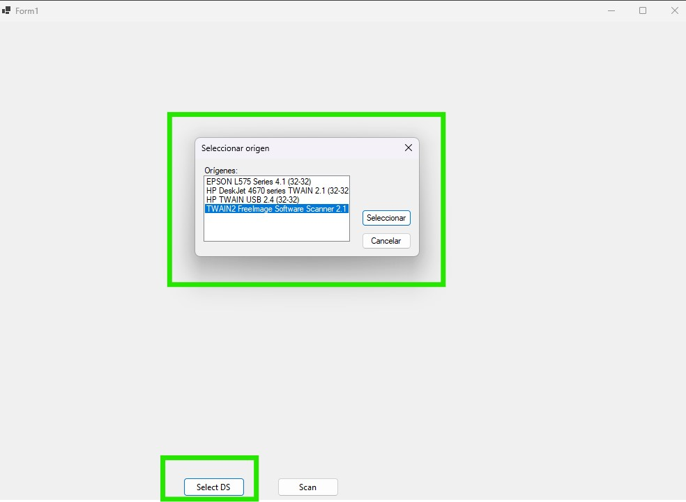
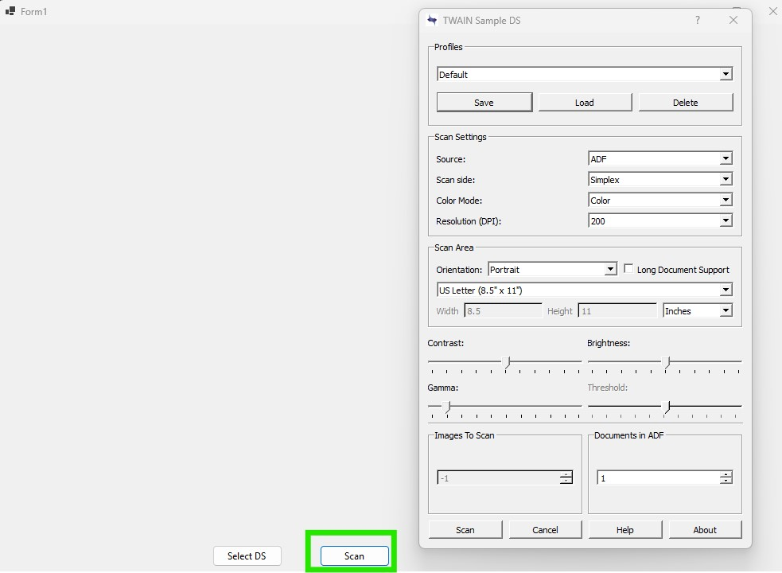
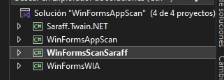

# ScanAppTwainSaraff
In this repository you can find three applications built for scan documents using Twain Saraff library and WIA. 
This is a C# .Net Core 8 Windows Forms Application. 
Also, you can use diferent trademarks of printers while it is suitable with twain drivers. This is for tests only.

1. Select a scanner

2. Clic on scanbutton

3. Setup the scanner as you need it

4. Select any project as default and test that.

